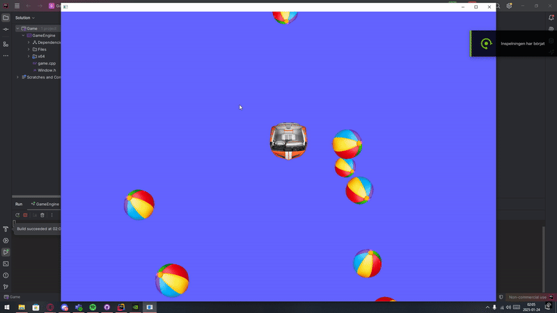

# Design-patterns-assignment Max Pålsson

### Creator
Max Pålsson

## Design Patterns

1. **Factory**  
   The [Factory](GameEngine/Files/Factories/BeachballFactory.cpp) pattern was used for the creation of the beachballs, making the process of creating them more centralized and less expensive for the system. 

2. **Flyweight**  
   The use of [Flyweight](GameEngine/Files/Util/TextureFlyWeight.cpp) makes the applying of textures on all the actors in the scene less impactful on the memory by not allowing every actor to hold their texture by themselves.

3. **Observer**  
   The [InputHandler](GameEngine/Files/InputHandler/InputHandler.h) is managed using the Observer pattern. With the observer pattern, all the keyboard inputs are handled within a single object in the scene. The keyboard inputs can then just subscribe to the input handler and become notified when needed, but other inputs can also be connected at a later point.

## Learnings
This has been a very valuable assignment for me. Even though I had a lot of problems implementing the design patterns in the beginning, the code benefited greatly from the different design patterns and became several times more readable from an outsiders perspective compared to my regular code structure. The selected design patterns made everything more centralized and easier to find while developing, making it easier to find desired functions and minimizing the possibility of forgetting the existance of some other functions.  
